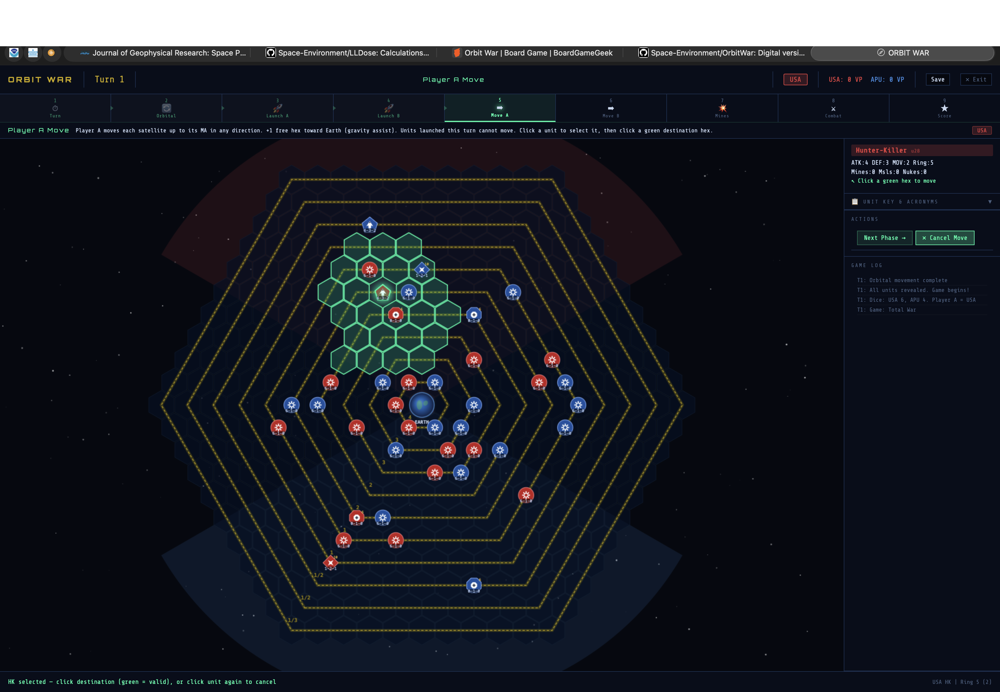

# Orbit War — The Digital Frontier

A browser-based digital adaptation of *Orbit War* © 1992 Steve Jackson Games, design by Wallace Wang.
Two players command satellite fleets in near-Earth orbit, firing missiles, laying mines, and accumulating
Victory Points until one side leads by 200 VP.

> **Original game:** *Orbit War* © 1992 Steve Jackson Games
> Design: Wallace Wang | Development: Steve Jackson




---

## How to Play (Web Game)

Open `orbit-war.html` in any modern browser. No installation, no build step, no server required.

### Entry Points

| Option | Description |
|--------|-------------|
| **Blockade** | Asymmetric 12-turn scenario. APU (45 pts) vs USA (35 pts). Unbalanced by design — play twice and swap sides. |
| **Total War** | Symmetric 100 vs 100 pts. Full force composition. Ends at a 200 VP lead or when the turn limit is reached. |
| **⚡ Easy Start** | Loads a pre-built Total War force for both sides, random placement, straight to Turn 1. |
| **📡 Tutorial** | Interactive 17-step spotlight walkthrough on a live board. Covers two full turns, every mechanic explained in context. Hands off to live play at the Combat phase. |
| **🎬 Watch a Game** | Demo autoplay (seed 6024). AI controls both sides at SLOW / NORMAL / FAST speed. |

A second **Quick Tutorial** strip in the bottom bar is available mid-session.

---

## The Map

### Orbit Lines and Rings

The board is a hex grid representing near-Earth space. Concentric **Orbit Lines** are numbered outward from Earth. In the web game these are referred to as **rings 1–10**; the original board labels them with fractional movement rates (see table below). Each ring determines how far a satellite **must** move during Orbital Movement — this movement is always **counterclockwise** and **mandatory**. No satellite may voluntarily stay still.

| Ring (web) | Board label | Speed (hexes/turn) | Notes |
|:---:|:---:|:---:|---|
| 1 | 4 | 4 | Innermost — retreat here causes atmospheric decay |
| 2 | 3 | 3 | |
| 3 | 3 | 3 | |
| 4 | 2 | 2 | |
| 5 | 2 | 2 | |
| 6 | 1 | 1 | |
| 7 | 1 | 1 | |
| 8 | ½ | ½ (even turns only) | |
| 9 | ½ | ½ (even turns only) | |
| 10 | ⅓ | ⅓ (turns 3, 6, 9…) | Deep Space entry point |

> **Board game note:** Fractional-line satellites require careful multi-turn tracking. Use a notepad to
> record which turns each fractional satellite is due to move. The web game handles this automatically.

### Spotting Cones

Each country has a **Spotting Cone** — a wedge-shaped region representing national radar coverage.
Spotting Cones extend along opposite map edges. They are critical for scoring:

- **EWR** satellites score 3 VP/turn when inside the *enemy* cone.
- **COM** satellites score 2 VP/turn when over *friendly* territory.
- **CJS** satellites score 2 VP/turn when over *friendly* territory.

Every 4th turn, **Earth Rotation** shifts both cones by 60° (one hex-side). The web game handles this
automatically in the Turn Track phase. On the board, the Earth counter is advanced and cone positions
re-evaluated.

> **Web game:** The cone apex tracks the Earth hex precisely during zoom and pan (`h2p({q:0,r:0})`).

---

## Turn Sequence

### Web Game (9 Phases)

| # | Phase | Auto/Manual | Notes |
|---|-------|:-----------:|-------|
| 1 | **Turn Track** | Auto | Advances turn counter. Earth rotates every 4th turn. Missiles in flight expire. VP snapshot taken for delta display. |
| 2 | **Orbital Movement** | Auto | All satellites sweep CCW by their ring speed. Mandatory, no exceptions. |
| 3 | **Player A Launches** | Manual | Up to 3 ELR launches from Earth (rings 1–3 only). OWPs/Space Stations/Shuttles in orbit may fire OLRs (max 3 per launcher, max 1 nuke per launcher). |
| 4 | **Player B Launches** | Manual | Same as above for Player B. |
| 5 | **Player A Move** | Manual | Optional movement up to MA hexes in any direction. +1 free hex toward Earth (gravity assist). Resupply available (blocks attack that turn). |
| 6 | **Player B Move** | Manual | Same as above for Player B. |
| 7 | **Mine Combat** | Auto | Mines (ATK 6), missiles (ATK 5), and nukes (ATK 5, −10 VP) fire against all enemy units in their hex. Mines cannot fire on the turn they were placed. |
| 8 | **Normal Combat** | Manual | Both players attack using the CRT. Each unit may attack once only. |
| 9 | **Scoring** | Auto | VPs awarded; win condition checked. Summary toast displayed. |

### Original Board Game (9 Phases)

The board game uses the same sequence but with two structural differences: Earth Rotation is a
**separate named phase** (phase 2), and there is no dedicated Scoring phase — VP scoring is understood
to occur at the end of each turn.

| # | Phase |
|---|-------|
| 1 | Turn Track |
| 2 | Earth Rotation |
| 3 | Orbital Movement |
| 4 | First Player Launches |
| 5 | Second Player Launches |
| 6 | First Player Optional Movement |
| 7 | Second Player Optional Movement |
| 8 | Mine Combat |
| 9 | Normal Combat |

> **Player order:** Player A goes first on odd-numbered turns; Player B goes first on even turns.
> Player A is determined by the higher die roll during setup.

> **Newly launched satellites skip Optional Movement** on the turn they arrive — Orbital Movement only.

---

## Units

### Satellites and Platforms

| Unit | ATK | DEF | MOV | Token | VP Kill | Key Rule |
|------|:---:|:---:|:---:|-------|:-------:|----------|
| **OWP** — Orbital Weapons Platform | 1 | 2 | 1 | Diamond | 1 | Fires OLRs (max 3/turn, max 1 nuke/turn). Cannot attack same turn it fires OLRs (§17). Carries up to 10 weapons. May lay mines directly in own hex (no rocket needed). Cannot carry other satellites. |
| **HK** — Hunter-Killer | 4 | 3 | 2 | Pentagon | 1 | Primary combat unit. May carry and use missiles. No special rules beyond standard combat. |
| **SS** — Space Station *(Advanced)* | 4 | 4 | 1 | Wide rect | 10 | Costs 12 pts. Orbit only (no Earth or Deep Space cost). Fires OLRs. Stores and transfers weapons. Can carry satellites as cargo and release them in orbit. Worth 10 VP if destroyed. |
| **EWR** — Early Warning Recon | 0 | 1 | 1 | Tall rect | 3 | Scores **3 VP/turn** inside enemy Spotting Cone. Jammed (0 VP) if inside *any* CJS radius 2 (friendly or enemy). |
| **COM** — Communications Sat *(Advanced)* | 0 | 1 | 1 | Rounded square | 0 | Scores **2 VP/turn** over friendly territory. |
| **CJS** — Comm Jamming Satellite | 0 | 1 | 2 | Hexagon | 0 | Scores **2 VP/turn** over friendly territory. Radius 2 area effect: +1 DEF friendly, −1 DEF enemy, 50% missile jam (roll 1–3 on d6), jams EWRs. CJS gains +1 DEF from its own effect. |
| **SF** — Special Forces | 3 | 2 | 1 | Rounded square | 1 | 12-turn orbital limit; removed at expiry (opponent scores VPs). Cannot be a Deep Space reinforcement. After 3 turns on Earth may return via rocket or Shuttle. May attack on the same turn they discharge from a rocket. |
| **Shuttle** | 2 | 1 | 2 | Rounded square | 3 | Fires OLRs. Carries up to 12 weapons (10 in Supply counter + 2 loose) plus one ELR or SF as cargo. Cannot be a Deep Space reinforcement. Cannot attack on the turn it resupplies or is resupplied. |
| **Supply Counter** | — | 1 | 0 | Octagon | — | Carries up to 10 weapons. OWP/Shuttle/SS in same hex may draw from it during movement (blocks attack that turn). Removed when empty. Enemy supplies may be captured and used — but not against their original owner (§12.2). |

> **Board game note (COM and SS):** COM satellites (§26) and Space Stations (§25) are **Advanced Rules**
> content in the original rulebook. They are included in the web game's base experience.

### Unit Costs by Deployment Zone

| Unit | In Orbit | Deep Space | On Earth |
|------|:--------:|:----------:|:--------:|
| EWR | 2 | 1.5 | 1 |
| COM | 2 | 1.5 | 1 |
| CJS | 4 | 2.5 | 2 |
| OWP | 3 | 2 | 1 |
| HK | 3 | 2 | 1 |
| SF | 2 | — | 1 |
| Shuttle | 4 | — | 2 |
| Space Station | 12 | — | — |
| ELR | — | — | 0.5 |
| OLR | 0 (free) | 0 (free) | 0 (free) |
| Mine | 0.5 | 0.5 | 0.5 |
| Missile | 0.5 | 0.5 | 0.5 |
| Nuke | 1 | 1 | 1 |
| 3-MIRV | 4 | 4 | 4 |
| 7-MIRV | 8 | 8 | 8 |
| Suicide Nuke (add-on) | +1 | +1 | +1 |

### Weapons

| Weapon | ATK | MOV | Notes |
|--------|:---:|:---:|-------|
| **Mine** | 6 | 0 | Stationary. Auto-fires Mine Combat every turn. Cannot fire turn placed (orange NEW badge). May be carried by OWPs, HKs, Shuttles, and Space Stations. |
| **Missile** | 5 | 2 | One turn only; auto-fires then removed. **No physical counter** — tracked on paper. Max range 5 hexes (board game). |
| **Nuke** | 5 | — | Must be launched via OLR. Costs owner **−10 VP** on detonation. |
| **3-MIRV** | 5 | — | Board game: splits into 3 independent warheads aimed at separate hexes. Web game: fires as a single nuke (not yet implemented). |
| **7-MIRV** | 5 | — | Board game: splits into 7 independent warheads. Web game: fires as a single nuke (not yet implemented). |
| **ELR** | 0 | 3 | Launches from Earth. Reaches rings 1–3. Max 3 per turn. Costs 0.5 pts each. Carries one satellite or payload. |
| **OLR** | 0 | 3 | Launched from OWPs, Shuttles, or Space Stations in orbit. Free and unlimited. Range 3 hexes. Max 3 per launcher per turn, max 1 nuke per launcher per turn. Cannot carry satellites. |

---

## Movement

### Orbital Movement (Mandatory)

Every satellite moves its ring-speed number of hexes counterclockwise. This cannot be skipped.
Fractional-rate satellites (rings 8–10) move only on their designated turns.

### Optional Movement

After Orbital Movement, each satellite may move up to its Movement Allowance (MA) in any direction,
including changing rings (moving toward or away from Earth). This is voluntary.

**Gravity Assist:** Any satellite may move **one extra hex toward Earth for free** during Optional
Movement. This is in addition to the normal MA and is optional.

**Mines and weapons** carried by a satellite move with it automatically — they have no independent movement.

### Launches

**ELR (Earth-Launched Rocket):** Launched during the Launch phase from Earth. Carries one satellite or
payload. The payload may be deployed during Optional Movement on the same turn (before, during, or after
the carrier moves). Mines deployed from a rocket cannot fire on their first turn. Newly launched units
skip Optional Movement on their arrival turn.

**OLR (Orbit-Launched Rocket):** Launched during the Launch phase from an OWP, Space Station, or
Shuttle in orbit. Carries a warhead, mine, or dummy (decoy in the board game — not implemented in the
web game). Deploys during Optional Movement.

### Reinforcements

Satellites may be held off-map as reinforcements and brought in during the game:

- **Earth Reinforcements:** Cheaper to buy; arrive via ELR, costing launch turns and ELR charges.
- **Deep Space Reinforcements:** More expensive; appear at the ring 10 map edge without ELR cost.

---

## Combat

### Combat Results Table (CRT)

The web game uses the **2d6 dice-roll system** from the original rulebook CRT. Combat differential = total
Attacker ATK − total Defender effective DEF (after CJS modifiers). Roll 2d6; if the sum meets or exceeds
the threshold the result is **HIT** (Defender Eliminated); otherwise it is **MISS**.

| Differential | Threshold | Approx. Odds |
|:---:|:---:|:---:|
| +5 or higher | 5+ | 83.3% |
| +4 | 6+ | 72.2% |
| +3 | 7+ | 58.3% |
| +2 | 8+ | 41.6% |
| +1 | 9+ | 27.7% |
| 0 | 10+ | 16.6% |
| −1 or −2 | 11+ | 8.3% |
| −3 or lower | impossible | 0% |

The combat dialog shows the threshold and odds before you commit the roll. You roll first, then choose
whether to apply. Multiple attackers and multiple defenders can be selected — all their ATK and DEF values
are summed for a single roll (stacked combat).

> **Note:** The web game's CRT produces only HIT or MISS (Defender Eliminated or no effect). The original
> board game's full DR/EX/AR/AE retreat table is not used in the web implementation.

### CJS Effect on Combat

A CJS within radius 2 of the target hex applies:
- **+1 DEF** to all friendly units in range (including itself)
- **−1 DEF** to all enemy units in range

These modifiers stack if multiple CJS units are in range. A CJS effectively has DEF 2 (1 printed + 1 from its own effect).

### Combat Rules

- Each unit may only **attack once** per turn.
- A unit may be **attacked multiple times** in the same turn.
- A player may attack any enemy unit in the **same hex**.
- Mine Combat resolves **before** Normal Combat — mines can destroy or weaken units before they fight back.
- **Stacked combat:** Multiple units on each side may be grouped into a single combined roll. All selected
  attackers' ATK values are summed, all selected defenders' DEF values are summed, and one 2d6 roll
  resolves the entire stack. All defending units are eliminated on a HIT.
- **Alternating combat turns:** At the start of Normal Combat, the player who goes first this turn (Player A
  on odd turns, Player B on even turns) makes one attack, then the opponent attacks, and so on, alternating
  until both sides have exhausted their attackers. The current attacker's side is shown in the action bar.
  A **Pass** button lets a side yield their turn if they choose not to attack.
- **Unit picker:** When multiple friendly units occupy the same hex, clicking the hex opens a picker dialog
  so you can choose exactly which unit to select or include in a stacked attack.

### Mine Combat

Mines (ATK 6) fire automatically against every enemy unit in their hex during the Mine Combat phase.
A single mine may attack multiple enemies in the same hex in one turn.

> **Board game rule (§6, not implemented in web game):** A unit retreating into a mined hex during
> retreat movement triggers that mine immediately.

### Missile Combat

Missiles (ATK 5) fire automatically during Mine Combat phase, then are removed.

**CJS Jamming:** Any missile passing through a CJS radius-2 zone has a 50% chance of being destroyed
(roll 1–3 on a d6). This is checked before the missile fires.

> **Board game note:** Missiles have a maximum range of 5 hexes. In the web game, missiles are delivered
> to their target hex via OLR (range 3), so the 5-hex cap is rarely relevant and is not enforced separately.

### Nuke and Suicide Nuke

- Nukes (ATK 5) placed by OLR auto-detonate during Mine Combat phase. The blast has **radius 1** — all
  units (friend and foe) within 1 hex of the detonation point are potential targets; each is resolved with
  a separate 2d6 roll.
- **First-strike penalty:** The **first nuke detonated in the game** (by either side) costs the firing
  player **−10 VP**. All subsequent nukes in the same game cost 0 VP. The penalty applies once per game,
  not once per player.
- **Suicide nukes (§18):** Any satellite (except SF and Shuttles) may be designated suicide at +1 pt
  during setup. The suicide attack (ATK 5) has **radius 1 blast** hitting all units (friend and foe) in
  range. The satellite is removed; the opponent scores VPs for its destruction. The first-strike penalty
  applies to the first suicide detonation just as it does to OLR nukes.
- A suicide satellite may use its regular weapons first and then detonate, or detonate before being attacked.

> **Web game note:** Suicide nuke identity is hidden until detonation. VP cannot drop below 0.

---

## Supply and Resupply (§12)

An OWP or Shuttle being resupplied must enter the same hex as the Supply counter. During resupply, any
or all contents (up to the receiving unit's capacity) may be transferred.

- **A unit being resupplied cannot attack** (Missile or Normal Combat) on that turn. It defends normally.
- **A Shuttle cannot attack** on the turn it resupplies or provides resupply.
- A Supply counter is removed from play when completely expended.
- If the carrier is destroyed, supplies are destroyed and the enemy scores VPs.

**Stolen Supplies (§12.2):** Enemy supplies may be captured (e.g., by an SF unit or Shuttle). Captured
supplies may be used, but **not against their original owner**.

> **Web game note:** The stolen supplies rule is not implemented. Supply interaction is limited to
> friendly OWP/Shuttle/SS in the same hex.

---

## OWP Rules (§17)

- Maximum 3 OLRs per OWP per turn.
- Maximum 1 nuke-carrying OLR per OWP per turn.
- An OWP **cannot both fire OLRs and attack in Normal Combat** on the same turn.
- An OWP may lay mines directly in its own hex without a rocket.
- OWPs must use OLRs to launch nukes (cannot drop nukes locally).

---

## Setup (§22)

### Step-by-Step

1. **Scenario Selection (§22.1):** Agree on Blockade or Total War (Strategic Campaign).
2. **Force Selection (§22.2):** Each player secretly selects forces within the point budget. Costs vary by deployment zone.
3. **Bookkeeping (§22.3):** Each player records on a separate sheet:
   - Which satellites are Earth / Deep Space reinforcements
   - Mines, missiles, and nuclear warheads carried by each OWP and Shuttle
   - Total weapon stocks per side
   - Which satellites carry suicide nukes
4. **Die Roll (§22.4):** High roller is Player A (goes first on odd turns).
5. **Placement:** Player A places one satellite face-down. Player B does the same. Alternate until
   all starting satellites are placed. **Blank (decoy) counters** may be mixed in face-down.
   Reinforcements remain off-map.
6. **Reveal:** All counters flip face-up simultaneously; blank decoy counters are removed.

> **Web game:** Decoy placement (step 5) is not implemented. Placement is manual (click a hex) or
> random. Bookkeeping is handled through the Force Builder and Bookkeeping dialogs.

---

## Victory Points

| Event | VP |
|-------|----|
| EWR inside enemy Spotting Cone | +3 per turn |
| COM over friendly territory | +2 per turn |
| CJS over friendly territory | +2 per turn |
| Space Station destroyed | +10 to destroyer |
| EWR destroyed | +3 to destroyer |
| Shuttle destroyed | +3 to destroyer |
| OWP, HK, or SF destroyed | +1 to destroyer |
| First nuke detonated (either side, either type) | −10 to firing player |
| Subsequent nukes detonated | 0 VP cost |

> **Rulebook note (§23):** The unit cost table lists SF as worth 2 VP, but the VP scoring section
> specifies "OWP or SF destroyed = 1 VP." The web game uses 1 VP, consistent with the scoring table.
> HK (1 VP) appears in the unit table but not the VP scoring section; the web game awards 1 VP,
> which aligns with the unit table.

> **Web game note:** VP cannot drop below 0.

### Win Conditions

| Scenario | Win Condition |
|----------|---------------|
| **Blockade** | Most VPs after turn 12. |
| **Total War** | First to lead by **200 VP** at the end of any Scoring phase. |

**Cease-fire (§23, board game only):** If 18 or more consecutive turns pass without either player
detonating a nuke or destroying an enemy unit, the game ends immediately in a cease-fire. The player
with the most VPs wins. Detonating any nuke ends a cease-fire instantly.

> **Web game:** The cease-fire condition is not tracked.

---

## Key Rules Quick Reference

- **Orbital movement is always mandatory and counterclockwise.** No unit may skip it.
- **Fractional-rate satellites** must be tracked carefully across turns (web game handles automatically).
- **Mine Combat fires before Normal Combat.** A mine can destroy a unit before it gets to fight back.
- **Newly placed mines cannot fire on the turn they are placed** (orange NEW badge on token).
- **Newly launched satellites skip Optional Movement** on their arrival turn.
- **An OWP cannot both fire OLRs and attack in Normal Combat on the same turn** (§17).
- **A unit being resupplied cannot attack that turn** (§12). It defends normally.
- **The first nuke detonated costs −10 VP (first-strike penalty)**; all subsequent nukes in the same game cost 0 VP. Use your first nuke only when the tactical gain clearly outweighs the penalty.
- **Suicide attacks hit all units in the hex — including your own** (§18). Position carefully before detonating.
- **EWRs jammed:** any CJS within radius 2 (friendly or enemy) jams an EWR — it scores 0 VP that turn.
- **Ring-1 retreat → atmospheric decay:** unit removed, no VP awarded to either side.

---

## AI Player

Either or both sides can be set to AI control using the **USA** / **APU** toggle buttons in the top bar.
When a side is AI-controlled:

- The AI auto-executes all phases for that side with a short countdown displayed in the top bar.
- During Normal Combat the AI participates in alternating combat: it attacks once, then the opponent
  attacks, alternating via `_aiOneCombatStep()` until all attackers are exhausted.
- A **Take Control** button appears during an AI countdown so a human can interrupt and take over.
- When both sides are AI-controlled the game runs continuously until a win condition is met (useful for
  watching a full game — see the Demo / Watch a Game mode which uses seed 6024).

---

## Known Gaps vs. Original Rulebook

| § | Mechanic | Status |
|---|----------|--------|
| §19 | **MIRV split** — 3-MIRV and 7-MIRV should deploy as 3 or 7 independent warheads aimed at separate hexes | Not implemented; fires as a single nuke |
| §23 | **Cease-fire** — 18 consecutive turns without a kill or nuke ends the game | Not tracked |
| §22 | **Decoy placement** — blank counters placed face-down during setup, revealed simultaneously | Not implemented |
| §6 | **Retreat into mined hex** — a retreating unit that enters a mined hex triggers that mine | Not checked |
| §12.2 | **Stolen supplies** — captured enemy supplies usable (but not against original owner) | Not implemented |

---

## UI Guide

### Board Controls

| Action | How |
|--------|-----|
| Select a unit | Click it during your active phase |
| Move a unit | Select it, then click a green destination hex |
| Attack | During Normal Combat, click an enemy in the same hex |
| Cancel selection | Click **✕ Cancel** in the Actions bar |
| Zoom | Scroll wheel, pinch-to-zoom (touch), or ＋ / − widget (bottom-right) |
| Pan | Click and drag |
| Reset view | Double-click canvas, or ⌂ in zoom widget |
| Inspect hex | Hover to see ring number and unit IDs in status bar |
| CJS radius | Hover over a CJS to highlight its jamming radius in green |

### Sidebar

| Panel | Appears When |
|-------|-------------|
| **Unit panel** | A unit is selected. Shows ATK/DEF/MOV, weapon loads, CJS modifier, available actions (⚔ Attack, ⛽ Resupply, ☢ Detonate). |
| **Launch panel** | During Launch phases. Lists Earth reserves (ELR), Deep Space reinforcements, and OLR-capable launchers in orbit. |
| **Unit Legend** | Always available — click to expand. Icon, full name, and rule notes for every unit type. |

### Token Shapes

| Shape | Unit(s) |
|-------|---------|
| Diamond | OWP |
| Pentagon | HK |
| Hexagon | CJS |
| Circle | Mine, OLR |
| Tall narrow rectangle | EWR |
| Very tall thin rectangle | ELR |
| Wide flat rectangle | Missile |
| Wide rectangle (~1.6:1) | Space Station |
| Upward triangle | Nuke, MIRV |
| Octagon | Supply Counter |
| Rounded square | SF, Shuttle, COM |

### Visual Indicators

| Indicator | Meaning |
|-----------|---------|
| Orange NEW badge on mine | Placed this turn — cannot fire yet |
| Dimmed token (α = 0.45) | Unit has already acted this phase |
| Green dot on EWR/COM/CJS | Scoring this turn |
| Red dot on EWR/COM/CJS | Jammed — not scoring |
| Orange ☄ toast | Atmospheric decay — unit removed, no VP |
| Gold toast | Scoring summary |
| VP delta in top bar | VP gained this turn by each side |

---

## Save / Load

**Save** (top-right button) serializes the full game state to `localStorage`. **Load Saved Game** on the
welcome screen restores it. One save slot per browser origin.

---

## Architecture (Web Game)

Single file: `orbit-war.html`. No build step.

```
Engine              — game state, rules enforcement, all phase logic, serialization
Renderer            — Canvas 2D drawing (board, units, overlays, zoom/pan)
UI                  — DOM interaction, dialogs, force builder, phase flow
SpotlightTutorial   — overlay walkthrough (17 steps, live engine)
Demo                — autonomous AI autoplay for the welcome screen
```

Supporting structures: `TUT_STEPS[]`, `PHASES[]` (9), `UTYPES{}`, `SCENARIOS{}`, `QUICK_STARTS{}`.

### Key Engine Methods

```
eng.advancePhase()                              step turn sequence; passive phases auto-execute
eng.fireOLR(id, type, hex)                     OLR launch → appends to state.launchTrails
eng.launchFromEarth(id, hex)                   ELR launch (rings 1–3 only, max 3/turn)
eng.bringInDeepSpace(id, hex)                  deep-space entry at ring 10
eng.moveUnit(id, hex)                          optional move with gravity assist (+1 inward free)
eng.combat(atkId, defId [,diceRoll])           single-unit CRT: validate then delegate to _doCombat
eng.stackedCombat(atkIds, defIds [,diceRoll])  multi-unit combined ATK/DEF, single 2d6 roll
eng._doCombat(atkIds, defIds [,diceRoll])      core 2d6 resolution shared by combat() and stackedCombat()
eng.transferSupply(supId, recId, {mines,missiles,nukes})
eng.detonateSuicide(uid)                       §18 suicide nuke, blast radius 1
eng._retreat(u)                                ring-1 → atmospheric decay
eng._score()                                   passive VP; stores state.scoringSummary
eng._inCone(hex, side)                         returns bool — EWR/COM scoring check
eng.serialize() / deserialize()                JSON save/load
```

### Key State Fields

```
state.orbTrails[]       {from, to, ringPath[], side, type}   — cleared at TURN_TRACK
state.launchTrails[]    {from, to, side, kind, payload}      — cleared at TURN_TRACK
state.optTrails[]       {from, to, side, typeId}             — cleared at MINE_CBT
state.atmoEvents[]      surfaced as ☄ toast
state.scoringSummary    {gains, events[]} → scoring toast
state.vpLastTurn        snapshot for delta display in top bar
state.earthRot          0–5, increments every 4th turn
state.elrLaunches       {usa, apu} — per-turn ELR counter, reset each TURN_TRACK
state.combatTurn        'usa'|'apu'|null — whose turn it is to attack in Normal Combat
state.firstNukeFired    bool — true after the first nuke ever detonates (enables free subsequent nukes)
state.nukeEvents[]      [{hex, blastHexes[]}] — blast animations rendered by Renderer
```

---

## Scenarios

### Blockade

| Side | Points | Turn Limit |
|------|:------:|:----------:|
| APU | 45 | 12 |
| USA | 35 | 12 |

Asymmetric and deliberately unbalanced. Win condition: most VPs after turn 12. Recommended to play twice, swapping sides.

### Total War (Strategic Campaign)

| Side | Points | Turn Limit |
|------|:------:|:----------:|
| USA | 100 | None |
| APU | 100 | None |

Symmetric full-force game. Win condition: lead by 200 VP at end of any Scoring phase.

---

## Credits

Original game design: **Wallace Wang**
Development: **Steve Jackson**
Published by: **Steve Jackson Games**, 1992

This digital adaptation is a fan implementation for personal use.
