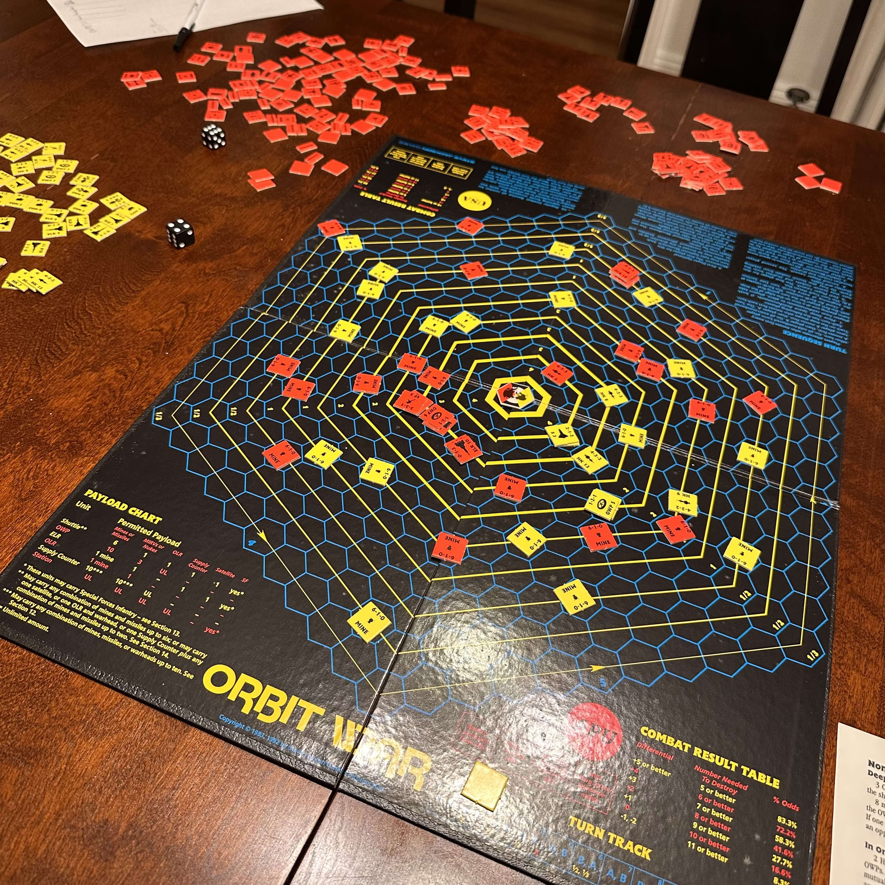

# Orbit War — The Digital Frontier

*Orbit War* © 1992 Steve Jackson Games, design by Wallace Wang.

Two superpowers fight for dominance of near-Earth space. You build a satellite fleet — weapons platforms, hunter-killers, recon birds, mines — and spend turns maneuvering them through orbital mechanics while accumulating Victory Points. The first side to open a **200 VP lead** wins. Every satellite in the enemy's spotting cone scores against you. Every Hunter-Killer you lose costs you attack power. Every nuke you fire costs you 10 VP — unless the kill is worth it.

This is a browser-based digital adaptation. Single HTML file, no install, no server.



---

## Table of Contents

- [Getting Started](#getting-started)
- [Scenarios](#scenarios)
- [The Map](#the-map)
  - [Rings and Orbital Speed](#rings-and-orbital-speed)
  - [Spotting Cones](#spotting-cones)
- [Turn Sequence](#turn-sequence)
- [Units](#units)
  - [Satellites and Platforms](#satellites-and-platforms)
  - [Weapons](#weapons)
  - [Unit Costs by Deployment Zone](#unit-costs-by-deployment-zone)
- [Movement](#movement)
  - [Orbital Movement](#orbital-movement-mandatory)
  - [Optional Movement](#optional-movement)
  - [Launches and Reinforcements](#launches-and-reinforcements)
- [Combat](#combat)
  - [Combat Results Table](#combat-results-table-crt)
  - [Normal Combat Rules](#normal-combat-rules)
  - [CJS Effect on Combat](#cjs-effect-on-combat)
  - [Mine Combat](#mine-combat)
  - [Missile Combat](#missile-combat)
  - [Nukes and Suicide Nukes](#nukes-and-suicide-nukes)
- [Victory Points and Win Conditions](#victory-points-and-win-conditions)
- [Supply and Resupply](#supply-and-resupply)
- [Setup](#setup)
- [Key Rules Quick Reference](#key-rules-quick-reference)
- [AI Player](#ai-player)
- [UI Guide](#ui-guide)
- [Save / Load](#save--load)
- [Known Gaps vs. Original Rulebook](#known-gaps-vs-original-rulebook)
- [Architecture](#architecture)
- [Credits](#credits)

---

## Getting Started

Open `orbit-war.html` in any modern browser. No installation, no build step, no server required.

| Option | Description |
|--------|-------------|
| **⚡ Easy Start** | Best for a first game. Loads a pre-built Total War force for both sides with random placement — straight to Turn 1. |
| **📡 Tutorial** | Interactive 17-step spotlight walkthrough on a live board. Covers two full turns with every mechanic explained in context. Hands off to live play at the Combat phase. |
| **🎬 Watch a Game** | Autoplay demo (seed 6018). AI controls both sides at SLOW / NORMAL / FAST speed. 6 lead changes, USA wins 511–483 by 28 VP. Good way to learn before playing. |
| **Total War** | Symmetric 100 vs 100 pts. Full force composition. Ends when one side leads by 200 VP. |
| **Blockade** | Asymmetric 12-turn scenario. APU (45 pts) vs USA (35 pts). Unbalanced by design — play twice and swap sides. |

A **Quick Tutorial** strip in the bottom bar is also available mid-game at any time.

---

## Scenarios

### Total War (Strategic Campaign)

| Side | Points | Win Condition |
|------|:------:|---------------|
| USA | 100 | Lead by **200 VP** at end of any Scoring phase |
| APU | 100 | Lead by **200 VP** at end of any Scoring phase |

The full game. Both sides have equal budgets to build diverse fleets. Expect 30–60 turns of orbital maneuvering, attrition, and VP grinding.

### Blockade

| Side | Points | Win Condition |
|------|:------:|---------------|
| APU | 45 | Most VPs after turn 12 |
| USA | 35 | Most VPs after turn 12 |

Deliberately asymmetric and imbalanced. APU has more resources; USA must play efficiently. Recommended to play twice, swapping sides.

**Cease-fire (§23, board game only):** If 18 or more consecutive turns pass without either player detonating a nuke or destroying an enemy unit, the game ends in a cease-fire and the player with more VPs wins. Not tracked in the web game.

---

## The Map

### Rings and Orbital Speed

The board is a hex grid representing near-Earth space. Concentric **Orbit Lines** are numbered outward from Earth — the web game calls them **rings 1–10**. Each ring determines how far a satellite **must** drift during Orbital Movement. Movement is always **counterclockwise** and always **mandatory** — no satellite may voluntarily stay still.

| Ring | Board Label | Speed | Notes |
|:----:|:-----------:|:-----:|-------|
| 1 | 4 | 4 hex/turn | Innermost — retreat here causes atmospheric decay |
| 2 | 3 | 3 hex/turn | |
| 3 | 3 | 3 hex/turn | |
| 4 | 2 | 2 hex/turn | |
| 5 | 2 | 2 hex/turn | |
| 6 | 1 | 1 hex/turn | |
| 7 | 1 | 1 hex/turn | |
| 8 | ½ | Every even turn | |
| 9 | ½ | Every even turn | |
| 10 | ⅓ | Turns 3, 6, 9… | Deep Space entry point |

> **Board game note:** Fractional-rate satellites require careful multi-turn tracking. Use a notepad to record which turns each satellite is due to move. The web game handles this automatically.

### Spotting Cones

Each side has a **Spotting Cone** — a wedge-shaped radar coverage zone extending along opposite map edges. Cones are critical for scoring:

| Unit | Scoring condition | VP/turn |
|------|-------------------|:-------:|
| EWR | Inside the *enemy* Spotting Cone | +3 |
| COM | Over *friendly* territory | +2 |
| CJS | Over *friendly* territory | +2 |

Every **4th turn**, Earth Rotation shifts both cones 60° (one hex-side). The web game handles this automatically during the Turn Track phase.

> A CJS within radius 2 of an EWR jams it — the EWR scores 0 VP that turn, regardless of whose CJS it is.

---

## Turn Sequence

Each turn runs through 9 phases in order. The web game enforces the sequence automatically — passive phases execute instantly; manual phases wait for player input.

| # | Phase | Mode | What Happens |
|---|-------|:----:|--------------|
| 1 | **Turn Track** | Auto | Turn counter advances. Earth rotates every 4th turn. Missiles in flight expire. VP snapshot taken for the delta display. |
| 2 | **Orbital Movement** | Auto | All satellites sweep CCW by their ring speed. Mandatory — no exceptions. |
| 3 | **Player A Launches** | Manual | Up to 3 ELR launches from Earth (rings 1–3 only). OWPs / Space Stations / Shuttles in orbit may fire OLRs (max 3 per launcher, max 1 nuke per launcher). |
| 4 | **Player B Launches** | Manual | Same as above for Player B. |
| 5 | **Player A Move** | Manual | Optional movement up to MA hexes in any direction. +1 free hex toward Earth (gravity assist). Resupply available (blocks attack that turn). |
| 6 | **Player B Move** | Manual | Same as above for Player B. |
| 7 | **Mine Combat** | Auto | Nukes detonate, then missiles fire, then mines fire — in that priority order. Each resolves against every enemy unit in the same hex. |
| 8 | **Normal Combat** | Manual | Both players attack using the CRT, alternating turns. Each unit may attack once only. |
| 9 | **Scoring** | Auto | VPs awarded; win condition checked; scoring summary displayed. |

**Player order:** Player A goes first on odd-numbered turns; Player B goes first on even turns. Player A is determined by the higher die roll during setup.

**Newly launched satellites skip Optional Movement** on their arrival turn — Orbital Movement only.

> **Original board game (9 phases):** Earth Rotation is a separate named phase (phase 2) and there is no dedicated Scoring phase — VP scoring is understood to occur at the end of the turn.

---

## Units

### Satellites and Platforms

| Unit | ATK | DEF | MOV | Token | Kill VP | Key Rule |
|------|:---:|:---:|:---:|:-----:|:-------:|----------|
| **OWP** — Orbital Weapons Platform | 1 | 2 | 1 | Diamond | 1 | Fires OLRs (max 3/turn, max 1 nuke/turn). Cannot attack in Normal Combat on the same turn it fires OLRs (§17). May lay mines in its own hex without a rocket. |
| **HK** — Hunter-Killer | 4 | 3 | 2 | Pentagon | 1 | Primary combat unit. High ATK, moderate DEF, good mobility. |
| **SS** — Space Station *(Advanced)* | 4 | 4 | 1 | Wide rect | 10 | Costs 12 pts. Orbit only. Fires OLRs. Stores and transfers weapons. Can carry satellites as cargo. **Worth 10 VP if destroyed — a prime target.** |
| **EWR** — Early Warning Recon | 0 | 1 | 1 | Tall rect | 3 | No attack. Scores **3 VP/turn** inside the enemy Spotting Cone. Jammed to 0 VP by any CJS within radius 2. |
| **COM** — Communications Sat *(Advanced)* | 0 | 1 | 1 | Rounded sq | 0 | No attack. Scores **2 VP/turn** over friendly territory. |
| **CJS** — Comm Jamming Satellite | 0 | 1 | 2 | Hexagon | 0 | Scores **2 VP/turn** over friendly territory. Radius-2 field: +1 DEF to friendly units, −1 DEF to enemies, 50% missile jam, jams EWRs. Gains +1 DEF from its own field (effective DEF 2). |
| **SF** — Special Forces | 3 | 2 | 1 | Rounded sq | 1 | 12-turn orbital limit; removed at expiry (opponent scores VP). Cannot be a Deep Space reinforcement. May attack on the same turn they discharge from a rocket. |
| **Shuttle** | 2 | 1 | 2 | Rounded sq | 3 | Fires OLRs. Carries up to 12 weapons plus one ELR or SF as cargo. Cannot attack on the turn it resupplies or is resupplied. |
| **Supply Counter** | — | 1 | 0 | Octagon | — | Carries up to 10 weapons. OWP / Shuttle / SS in the same hex may draw from it during movement (blocks attack that turn). Removed when empty. |

> **COM and SS** are Advanced Rules content in the original rulebook. They are included in the web game's base experience.

### Weapons

| Weapon | ATK | Notes |
|--------|:---:|-------|
| **Mine** | 6 | Stationary. Auto-fires during Mine Combat every turn against all enemies in its hex. Cannot fire the turn it is placed (orange **NEW** badge). |
| **Missile** | 5 | Launched via OLR. Auto-fires during Mine Combat phase on the following turn, then is removed. 50% chance of being jammed by a CJS in its path. |
| **Nuke** | 5 | Launched via OLR. Detonates during Mine Combat phase. **Blast radius 1** — hits all units (friend and foe) within 1 hex. The first nuke fired costs **−10 VP** to the firing player. |
| **3-MIRV** | 5 | Board game: splits into 3 independent warheads. Web game: fires as a single nuke. |
| **7-MIRV** | 5 | Board game: splits into 7 independent warheads. Web game: fires as a single nuke. |
| **ELR** | — | Earth-Launched Rocket. Carries one satellite to rings 1–3. Max 3 per turn per side. Costs 0.5 pts each. |
| **OLR** | — | Orbit-Launched Rocket. Fired from OWPs, Shuttles, or Space Stations. Free, range 3 hexes. Max 3 per launcher per turn, max 1 nuke per launcher per turn. |

### Unit Costs by Deployment Zone

Units bought during setup are cheaper the further from Earth they start. Deep Space units appear at ring 10 without requiring an ELR launch.

| Unit | In Orbit | Deep Space | On Earth |
|------|:--------:|:----------:|:--------:|
| EWR | 2 | 1.5 | 1 |
| COM | 2 | 1.5 | 1 |
| CJS | 4 | 2.5 | 2 |
| OWP | 3 | 2 | 1 |
| HK | 3 | 2 | 1 |
| SF | 2 | — | 1 |
| Shuttle | 4 | — | 2 |
| Space Station | 12 | — | — |
| ELR | — | — | 0.5 |
| OLR | 0 | 0 | 0 |
| Mine | 0.5 | 0.5 | 0.5 |
| Missile | 0.5 | 0.5 | 0.5 |
| Nuke | 1 | 1 | 1 |
| 3-MIRV | 4 | 4 | 4 |
| 7-MIRV | 8 | 8 | 8 |
| Suicide Nuke (add-on) | +1 | +1 | +1 |

---

## Movement

### Orbital Movement (Mandatory)

At the start of every turn, every satellite drifts counterclockwise by its ring speed (see the ring table above). This step is automatic and cannot be skipped or modified. Fractional-rate satellites on rings 8–10 only move on their designated turns.

### Optional Movement

After Orbital Movement, each satellite may move up to its Movement Allowance (MA) in any direction — including changing rings (moving toward or away from Earth). This is voluntary.

**Gravity Assist:** Any satellite may move one extra hex toward Earth for free during Optional Movement, in addition to its normal MA.

Weapons and mines carried by a satellite move with it automatically.

### Launches and Reinforcements

**ELR (Earth-Launched Rocket):** Launched during the Launch phase. Carries one satellite or payload to rings 1–3. Max 3 ELR launches per side per turn. Newly launched satellites skip Optional Movement on arrival — Orbital Movement only.

**OLR (Orbit-Launched Rocket):** Fired from an OWP, Space Station, or Shuttle in orbit during the Launch phase. Carries a missile, mine, or nuke up to 3 hexes. Free and reusable each turn. Max 3 per launcher, max 1 nuke per launcher per turn.

**Reinforcements:**
- **Earth Reinforcements** — cheaper to purchase; arrive via ELR over multiple turns.
- **Deep Space Reinforcements** — more expensive; enter at the ring 10 edge without ELR cost.

---

## Combat

### Combat Results Table (CRT)

Combat uses **2d6 dice rolls** against a threshold determined by the combat differential.

**Combat differential** = total ATK (all selected attackers) − total effective DEF (all selected defenders, after CJS modifiers).

Roll 2d6. If the sum **meets or exceeds** the threshold, the result is **HIT** (all selected defenders eliminated). Otherwise it is **MISS**.

| Differential | Roll Needed (2d6) | Odds |
|:------------:|:-----------------:|:----:|
| +5 or higher | 5 or better | 83.3% |
| +4 | 6 or better | 72.2% |
| +3 | 7 or better | 58.3% |
| +2 | 8 or better | 41.6% |
| +1 | 9 or better | 27.7% |
| 0 | 10 or better | 16.6% |
| −1 or −2 | 11 or better | 8.3% |
| −3 or lower | Impossible | 0% |

The combat dialog shows the differential, threshold, and odds before you roll. **Once you roll the dice the result is committed** — the Cancel button is hidden. Click **Apply** to resolve it.

> **Note:** The web CRT produces only HIT or MISS. The original board game's full retreat table (DR/EX/AR/AE outcomes) is not used in the web implementation.

### Normal Combat Rules

- Each unit may **attack once** per turn.
- A unit may be **attacked multiple times** per turn.
- You may only attack enemies in the **same hex** as your attacking unit.
- **Stacked combat:** Select multiple attackers and/or multiple defenders. Their ATK and DEF values are summed for a single 2d6 roll. All selected defenders are eliminated on a HIT.
- **Alternating turns:** The player who goes first this turn makes one attack, then the opponent attacks, and so on until both sides are exhausted. The active side is shown in the action bar. A **Pass** button lets a side yield their attack turn.
- **Unit picker:** When multiple units share a hex, clicking opens a picker dialog so you can select the exact unit you intend to act with.

### CJS Effect on Combat

A CJS within **radius 2** of the target hex modifies all combat in that area:

- **+1 DEF** to all friendly units in range (including the CJS itself)
- **−1 DEF** to all enemy units in range

Multiple CJS units stack. A CJS effectively has DEF 2 (1 printed + 1 from its own field).

### Mine Combat

Mines (ATK 6) fire automatically during the Mine Combat phase against every enemy unit in their hex. A single mine may attack multiple enemies in the same hex in one turn. Mines cannot fire on the turn they are placed.

**Priority order within Mine Combat:** nukes detonate first, then missiles fire, then mines fire. A missile arriving at a mined hex can destroy the mine before the mine fires back.

> **Board game rule (§6, not implemented):** A unit retreating into a mined hex during retreat movement triggers that mine immediately.

### Missile Combat

Missiles (ATK 5) fired via OLR arrive at their target hex and auto-fire during the Mine Combat phase on the following turn, then are removed.

**CJS Jamming:** Any missile traveling through a CJS radius-2 zone has a **50% chance of being destroyed** before it fires (roll 1–3 on a d6 = jammed).

### Nukes and Suicide Nukes

**OLR Nukes:** Placed via OLR, detonate during Mine Combat phase. Blast radius 1 — every unit (friend and foe) within 1 hex is a separate target, each resolved with its own 2d6 roll.

**First-strike penalty:** The **first nuke detonated in the game** (by either side, either type) costs the firing player **−10 VP**. All subsequent nukes in the same game cost 0 VP. The penalty applies once per game, not once per player.

**Suicide Nukes (§18):** Any satellite except SF and Shuttles may be designated as suicide (+1 pt at setup). Detonation has ATK 5, blast radius 1, hits all units friend and foe in range. The satellite is removed and the opponent scores its kill VP. The first-strike penalty applies to the first suicide detonation just as it does to OLR nukes.

> VP cannot drop below 0.

---

## Victory Points and Win Conditions

### Scoring

VP are awarded at the end of every turn during the Scoring phase.

| Event | VP |
|-------|----|
| EWR inside enemy Spotting Cone | +3 per turn |
| COM over friendly territory | +2 per turn |
| CJS over friendly territory | +2 per turn |
| Space Station destroyed | +10 to destroyer |
| EWR destroyed | +3 to destroyer |
| Shuttle destroyed | +3 to destroyer |
| OWP, HK, or SF destroyed | +1 to destroyer |
| First nuke detonated in the game | −10 to firing side |
| Subsequent nukes detonated | 0 |

> **Rulebook note:** SF is listed at 2 VP in the unit cost table but 1 VP in the scoring section. The web game uses 1 VP, consistent with the scoring table.

### Win Conditions

| Scenario | Win Condition |
|----------|---------------|
| **Total War** | First to lead by **200 VP** at end of any Scoring phase |
| **Blockade** | Most VPs after **turn 12** |

---

## Supply and Resupply

An OWP or Shuttle being resupplied must move into the same hex as the Supply Counter during Optional Movement. Any or all contents may be transferred.

- **A unit being resupplied cannot attack** that turn. It may defend normally.
- **A Shuttle cannot attack** on the turn it resupplies or provides resupply.
- A Supply Counter is removed when completely expended.
- If a unit carrying supplies is destroyed, those supplies are also destroyed.

**Stolen Supplies (§12.2):** Captured enemy supplies may be used — but **not against their original owner**.

> **Web game:** The stolen supplies rule is not implemented. Supply interaction is limited to friendly OWP / Shuttle / SS in the same hex.

---

## Setup

1. **Scenario (§22.1):** Agree on Blockade or Total War.
2. **Force Selection (§22.2):** Each player secretly chooses units within the point budget. Costs vary by deployment zone (see cost table above).
3. **Bookkeeping (§22.3):** Record which satellites are Earth / Deep Space reinforcements, weapon loads per OWP and Shuttle, total weapon stocks, and which satellites carry suicide nukes.
4. **Die Roll (§22.4):** High roller is Player A (goes first on odd turns).
5. **Placement:** Player A places one satellite face-down. Player B does the same. Alternate until all starting satellites are placed. Blank **decoy counters** may be mixed in face-down. Reinforcements stay off-map.
6. **Reveal:** All counters flip face-up simultaneously. Blank decoy counters are removed.

> **Web game:** Decoy placement is not implemented. Placement is manual (click a hex) or random via Easy Start. Bookkeeping is handled through the Force Builder dialog.

---

## Key Rules Quick Reference

Use this as a mid-game reminder. Click any rule for full context above.

| Rule | Detail |
|------|--------|
| Orbital movement | Always mandatory, always counterclockwise. No unit may skip it. |
| Turn order | Player A goes first on odd turns, Player B on even turns. Alternates every turn. |
| Mine Combat priority | Nukes → Missiles → Mines. All fire before Normal Combat. |
| New mines | Cannot fire the turn they are placed (orange NEW badge). |
| New satellites | Skip Optional Movement on their arrival turn. |
| OWP restriction | Cannot fire OLRs **and** attack in Normal Combat on the same turn (§17). |
| Resupply restriction | A unit being resupplied cannot attack that turn. |
| First-strike penalty | Only the **first** nuke detonated in the game costs −10 VP to the firer. All subsequent nukes are free. |
| Suicide nukes | Blast hits all units in radius — including your own. Position carefully. |
| CJS jamming | Any CJS within radius 2 jams EWRs to 0 VP and jams missiles at 50% (whether friend or foe). |
| Atmospheric decay | A unit forced to retreat from ring 1 is removed. No VP awarded to either side. |
| HK vs HK combat | The attacker rolls 2d6 on the CRT (ATK 4 − DEF 3 = diff +1 → need 9+, 27.7% hit chance). The defender does not automatically shoot back; they must wait for their own attack turn. |

---

## AI Player

Either or both sides can be set to AI control using the **USA** / **APU** toggle buttons in the top bar.

- The AI auto-executes all phases for that side with a short countdown displayed in the action bar.
- During Normal Combat the AI participates in alternating combat — it attacks once, the opponent attacks, and so on until all attackers are exhausted.
- A **Take Control** button appears during the AI countdown so a human can interrupt and take over at any point.
- When both sides are AI-controlled the game runs continuously until the win condition is met. The **🎬 Watch a Game** mode uses this with seed 6018 for a deterministic, dramatic replay.
- AI dice rolls use the same `Math.random()` as human play — browser-seeded from OS entropy, unpredictable each session. Only the demo uses a fixed seed (`mulberry32(6018)`) for deterministic replay.

---

## UI Guide

### Board Controls

| Action | How |
|--------|-----|
| Select a unit | Click it during your active phase |
| Choose from a stack | Click a multi-unit hex — a picker dialog lists all units |
| Move a unit | Select it, then click a green destination hex |
| Attack | During Normal Combat, click an enemy in the same hex |
| Cancel selection | Click **✕ Cancel** in the action bar |
| Zoom | Scroll wheel, pinch-to-zoom, or ＋/− widget (bottom-right) |
| Pan | Click and drag |
| Reset view | Double-click canvas, or ⌂ in the zoom widget |
| Inspect hex | Hover — ring number and unit IDs appear in the status bar |
| CJS radius | Hover over a CJS to highlight its radius-2 jamming field in green |

### Sidebar Panels

| Panel | When It Appears |
|-------|-----------------|
| **Unit panel** | A unit is selected. Shows ATK / DEF / MOV, weapon loads, CJS modifier, and available actions (⚔ Attack, ⛽ Resupply, ☢ Detonate). |
| **Launch panel** | During Launch phases. Lists Earth reserves, Deep Space reinforcements, and OLR-capable launchers in orbit. |
| **Unit Legend** | Always available — click to expand. Full name, icon, and rule notes for every unit type. |

### Token Shapes

| Shape | Unit |
|-------|------|
| Diamond | OWP |
| Pentagon | HK |
| Hexagon | CJS |
| Circle | Mine, OLR in flight |
| Tall narrow rectangle | EWR |
| Very tall thin rectangle | ELR |
| Wide flat rectangle | Missile |
| Wide rectangle (~1.6:1) | Space Station |
| Upward triangle | Nuke, MIRV |
| Octagon | Supply Counter |
| Rounded square | SF, Shuttle, COM |

### Visual Indicators

| Indicator | Meaning |
|-----------|---------|
| Orange **NEW** badge on mine | Placed this turn — cannot fire yet |
| Dimmed token (α = 0.45) | Unit has already acted this phase |
| Green dot on EWR / COM / CJS | Scoring this turn |
| Red dot on EWR / COM / CJS | Jammed — not scoring |
| Orange ☄ toast | Atmospheric decay — unit removed, no VP awarded |
| Gold toast | Scoring phase summary |
| VP delta in top bar | VP gained this turn by each side |

---

## Save / Load

**Save** (top-right button) serializes the full game state to `localStorage`. **Load Saved Game** on the welcome screen restores it. One save slot per browser origin.

---

## Known Gaps vs. Original Rulebook

| § | Mechanic | Status |
|---|----------|--------|
| §19 | **MIRV split** — 3-MIRV and 7-MIRV should deploy as 3 or 7 independent warheads aimed at separate hexes | Not implemented; fires as a single nuke |
| §23 | **Cease-fire** — 18 consecutive turns without a kill or nuke ends the game | Not tracked |
| §22 | **Decoy placement** — blank counters placed face-down during setup, revealed simultaneously | Not implemented |
| §6 | **Retreat into mined hex** — retreating into a mined hex triggers that mine immediately | Not checked |
| §12.2 | **Stolen supplies** — captured enemy supplies usable (but not against original owner) | Not implemented |

---

## Architecture

Single file: `orbit-war.html`. No build step, no dependencies except Google Fonts.

```
Engine              — game state, rules enforcement, all phase logic, serialization
Renderer            — Canvas 2D drawing (board, units, overlays, zoom/pan)
UI                  — DOM interaction, dialogs, force builder, phase flow
SpotlightTutorial   — overlay walkthrough (17 steps, live engine)
AIPlayer            — AI decision logic for launches, movement, and combat
Demo                — autonomous AI autoplay for the welcome screen (seed 6018)
```

Supporting data: `TUT_STEPS[]`, `PHASES[]` (9), `UTYPES{}`, `SCENARIOS{}`, `QUICK_STARTS{}`.

### Key Engine Methods

```
eng.advancePhase()                              step turn sequence; passive phases auto-execute
eng.fireOLR(id, type, hex)                     OLR launch → appends to state.launchTrails
eng.launchFromEarth(id, hex)                   ELR launch (rings 1–3 only, max 3/turn)
eng.bringInDeepSpace(id, hex)                  deep-space entry at ring 10
eng.moveUnit(id, hex)                          optional move with gravity assist (+1 inward free)
eng.combat(atkId, defId [,diceRoll])           single-unit CRT: validate then delegate to _doCombat
eng.stackedCombat(atkIds, defIds [,diceRoll])  multi-unit combined ATK/DEF, single 2d6 roll
eng._doCombat(atkIds, defIds [,diceRoll])      core 2d6 resolution shared by combat() and stackedCombat()
eng.transferSupply(supId, recId, {mines,missiles,nukes})
eng.detonateSuicide(uid)                       §18 suicide nuke, blast radius 1
eng._retreat(u)                                ring-1 → atmospheric decay
eng._score()                                   passive VP; stores state.scoringSummary
eng._inCone(hex, side)                         returns bool — EWR/COM scoring check
eng.serialize() / deserialize()                JSON save/load to localStorage
```

### Key State Fields

```
state.orbTrails[]       {from, to, ringPath[], side, type}   — cleared at TURN_TRACK
state.launchTrails[]    {from, to, side, kind, payload}      — cleared at TURN_TRACK
state.optTrails[]       {from, to, side, typeId}             — cleared at MINE_CBT
state.atmoEvents[]      surfaced as ☄ toast
state.scoringSummary    {gains, events[]} → scoring toast
state.vpLastTurn        snapshot for delta display in top bar
state.earthRot          0–5, increments every 4th turn
state.elrLaunches       {usa, apu} — per-turn ELR counter, reset each TURN_TRACK
state.combatTurn        'usa'|'apu'|null — whose turn to attack in Normal Combat
state.firstNukeFired    bool — true after first nuke detonates (subsequent nukes cost 0 VP)
state.nukeEvents[]      [{hex, blastHexes[]}] — blast animation data for Renderer
```

---

## Credits

Original game design: **Wallace Wang**
Development: **Steve Jackson**
Published by: **Steve Jackson Games**, 1992

This digital adaptation is a fan implementation for personal use.
